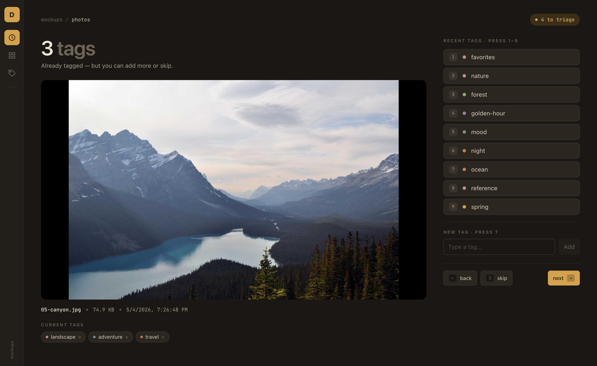
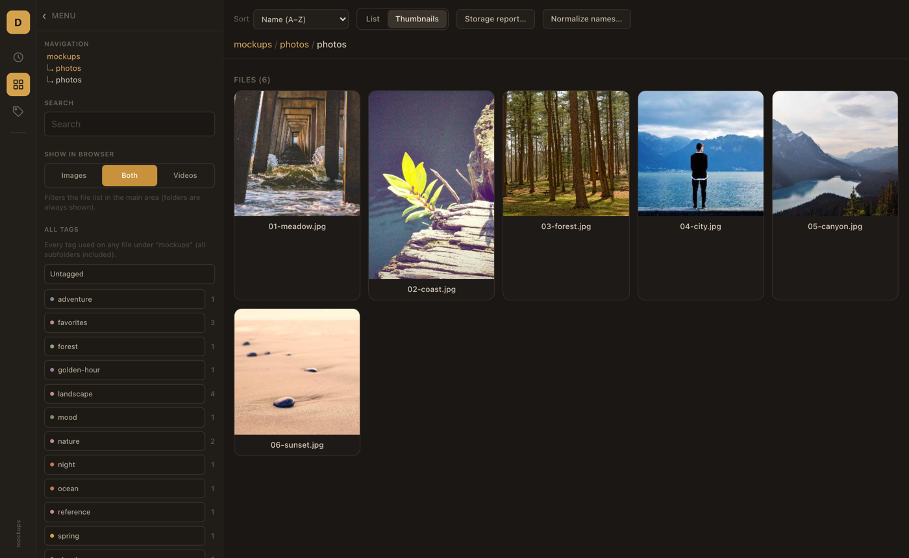
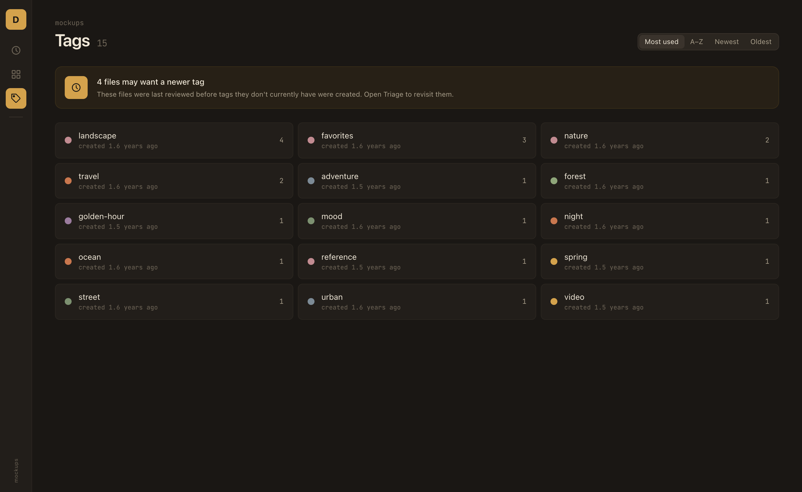

# degu

*a media browser that travels with your files.*

[](https://codecov.io/gh/georgebuilds/degu)

A local-first media browser. Browse, search, tag, preview, A–B-loop, trim, and rename media files without uploading anything to the cloud.

degu runs two ways:

- **Desktop app / server** (primary): a Go server + SQLite database handles the filesystem and tags. Distributed as a native Wails desktop app (macOS arm64; Linux x64 and Windows x64 GUI builds are experimental) and a cross-platform CLI binary (`degu /path/to/folder`).
- **Drop-on-drive** (FSA fallback): open `dist/index.html` directly in a Chromium browser. Tags are stored in `index.json` next to your media — no server required.

## Screenshots

| Triage | Library | Tags |
|--------|---------|------|
|  |  |  |

## Features

- **Triage**: card-by-card tagging workflow for stale and untagged files — the default mode.
- **Browse**: list and thumbnail views, breadcrumb navigation, URL-hash routing (browser Back works).
- **Tag**: images and videos. Quick-add chips, a "More" submenu, and bulk multi-select editing are built in.
- **Tags screen**: manage your tag vocabulary — counts, creation dates, and stale-file indicators.
- **Preview**: images and videos in a modal (keyboard-navigable, sibling navigation).
- **A–B loops**: save multiple loop ranges per video and pin them to a side-by-side viewer pane.
- **Trim videos** in-browser with `ffmpeg.wasm` (`-c copy`, fast, keyframe-snapped). Output saves to a sibling file or via Save As.
- **Normalize filenames** in bulk by removing substrings; tag entries follow the rename.
- **Storage stats**: byte totals broken down by kind, extension, and tag.
- **Search** filenames recursively under the current folder.

## Browser support

Drop-on-drive mode uses the [File System Access API](https://developer.mozilla.org/docs/Web/API/File_System_Access_API) (`showDirectoryPicker`, `FileSystemFileHandle.move`, `showSaveFilePicker`) and multithreaded `@ffmpeg/core-mt` (cross-origin isolation required).

**Chromium-based browsers only** for drop-on-drive (Chrome, Edge, Brave, Arc, etc.). Safari and Firefox do not implement the required APIs.

When running as the desktop app or headless server, the Wails WKWebView / localhost Chromium instance handles these constraints automatically.

## Running degu

**Travel-with-files (recommended).** Download the `.app` (macOS), the `degu` binary (Linux), or `degu.exe` (Windows) from [Releases](https://github.com/georgebuilds/degu/releases/latest). Drop it into the folder of media you want to browse and double-click. degu serves that folder — your tags and SQLite DB live next to it, so the whole thing travels as one unit when you move the drive.

degu strictly serves the folder the binary lives in; there is no fallback. Putting it in `/Applications` or `/usr/local/bin` means degu will try to serve those directories, which is almost never what you want — use an explicit path arg in that case.

**Or pass an explicit path**:
```bash
degu /path/to/folder          # serves on localhost:7878, opens browser
degu --no-browser /path       # server only
degu --port 8080 /path
```

**Drop-on-drive (no binary needed).** Open `dist/index.html` in a Chromium browser. Pick a folder when prompted. The FSA handle is persisted in IndexedDB; reloads prompt for a single re-grant click.

## Development

```bash
npm install
npm run dev          # Vite dev server (FSA mode — no Go server needed)
npm run build        # tsc -b && vite build → dist/index.html
npm run preview      # serve the built SPA bundle
npm test             # Vitest (run mode)
npm run test:watch
```

Tech: **Preact 10**, **TypeScript**, **Vite 8**, **Tailwind CSS v4**, **Vitest 4** (`@testing-library/preact` + `happy-dom` for component tests), **`@ffmpeg/ffmpeg`** + `@ffmpeg/core-mt` + `@ffmpeg/util` for video trim, **Go 1.25**, **SQLite** (`modernc.org/sqlite`), **Wails v2**.

## Where things live

- `main.go` — Wails desktop entry (macOS arm64)
- `cmd/degu/` — headless CLI server
- `internal/server/` — HTTP handler: SPA embed, `/api/*` routes, COOP/COEP headers
- `internal/db/` — SQLite tag store + legacy `index.json` importer
- `src/app.tsx` — boot: HTTP driver detection → FSA fallback
- `src/components/` — UI: AppShell, ModeRail, FileBrowser, TriageScreen, TagsScreen, modals, viewer
- `src/lib/` — storage drivers, pure helpers, File System Access I/O

## For AI agent contributors

See [`agents.md`](agents.md) for the architecture map, conventions, and testing notes.

## Contributing

Issues and PRs welcome. See [`CONTRIBUTING.md`](CONTRIBUTING.md) for dev setup, code style, and the DCO sign-off workflow, and [`agents.md`](agents.md) for architecture. Security reports go to degu.barstool750 [at] passmail [dot] net (replace [at] with @ and [dot] with .) — see [`SECURITY.md`](SECURITY.md).

## License

degu is licensed under **AGPL-3.0-or-later** ([`LICENSE`](LICENSE)). Because AGPL extends copyleft to network use, anyone who runs a modified version of degu as a network/SaaS service must offer the corresponding source to its users; for personal local-only use the practical effect is the same as GPL.
